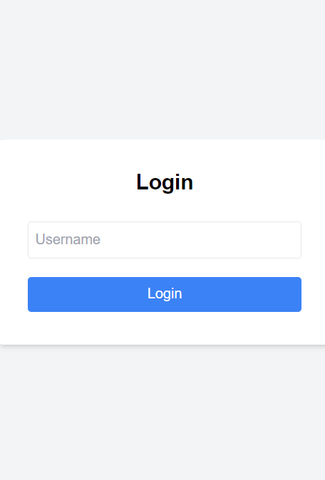
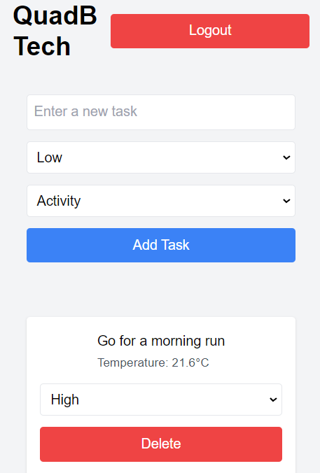
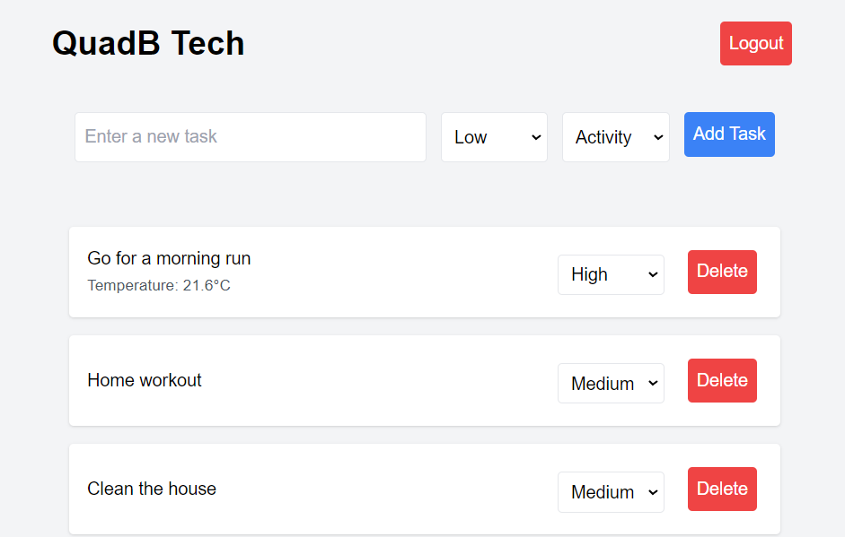
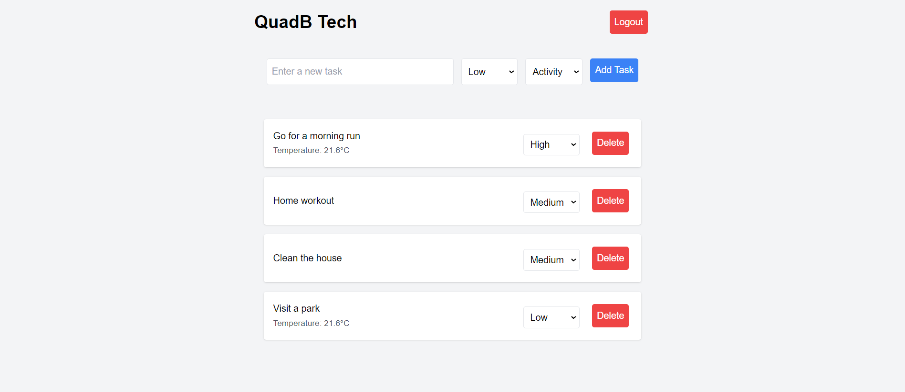

# QuadB tech - Advanced To-Do App

## Setup Instructions
1. Clone the repository
    ```bash
    git clone https://github.com/yashughade10/quad-b-tech-to-do.git
    cd advanced-todo-app
    ```
2. Install dependencies
    ```bash
    npm install
    ```
3. Run the development server
    ```bash
    npm run dev
    ```

## Features
- Add, view, and delete tasks
- Set task priorities
- Responsive design
- Weather data integration
- User authentication

### Screenshots
#### Mobile View



#### Tablet View


#### Desktop View


## Live Demo
[Live Demo URL](https://quad-b-tech-to-do-list.vercel.app/login)
